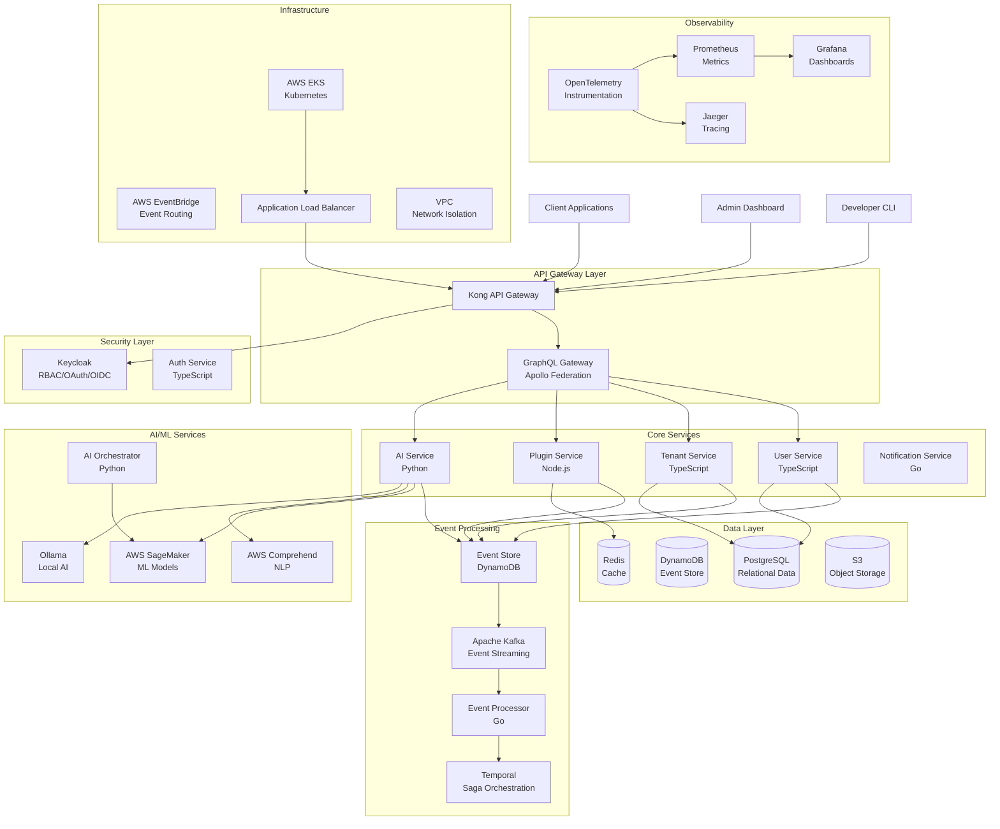
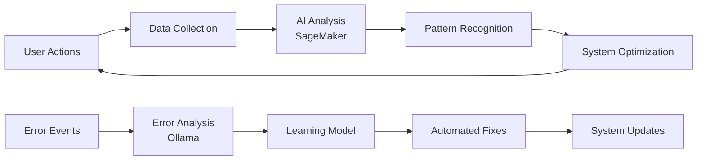

# AI-Native SaaS Platform - System Architecture

## Architecture Overview

This document outlines the architecture for an AI-native, cloud-native SaaS platform adhering to MACH principles (Microservices, API-first, Cloud-native, Headless) with clean/hexagonal architecture, event-driven microservices, and comprehensive AI integration.

## Core Architectural Principles

### MACH Compliance
- **Microservices**: Independently deployable services with clear boundaries
- **API-first**: GraphQL and REST APIs for all service interactions
- **Cloud-native**: Kubernetes-based deployment with AWS services integration
- **Headless**: Decoupled frontend and backend with flexible presentation layers

### Clean/Hexagonal Architecture
- **Domain Layer**: Core business logic isolated from external concerns
- **Application Layer**: Use cases and application services
- **Infrastructure Layer**: External systems, databases, and frameworks
- **Ports & Adapters**: Clear interfaces between layers

## System Architecture Diagram

## Service Roles and Responsibilities

### Core Services

#### User Service (TypeScript/Node.js)
- **Purpose**: User management, profiles, preferences
- **Responsibilities**:
  - User registration and profile management
  - User preference tracking for AI personalization
  - Integration with Keycloak for authentication
- **Architecture**: Clean architecture with domain, application, and infrastructure layers
- **Events**: UserCreated, UserUpdated, UserPreferencesChanged

#### Tenant Service (TypeScript/Node.js)
- **Purpose**: Multi-tenant organization management
- **Responsibilities**:
  - Tenant provisioning and configuration
  - Resource allocation and billing
  - Tenant-specific customizations
- **Architecture**: Hexagonal architecture with tenant isolation
- **Events**: TenantCreated, TenantConfigured, ResourceAllocated

#### Plugin Service (Node.js)
- **Purpose**: Dynamic plugin management and execution
- **Responsibilities**:
  - Plugin registration and lifecycle management
  - Dynamic loading and execution of plugins
  - Plugin marketplace and versioning
- **Architecture**: Plugin architecture with sandboxed execution
- **Events**: PluginInstalled, PluginExecuted, PluginUpdated

#### AI Service (Python)
- **Purpose**: AI/ML orchestration and model management
- **Responsibilities**:
  - Model deployment and inference
  - AI-driven insights and recommendations
  - Integration with AWS SageMaker and Ollama
- **Architecture**: ML pipeline architecture with model versioning
- **Events**: ModelDeployed, InferenceCompleted, InsightGenerated

#### Notification Service (Go)
- **Purpose**: Real-time notifications and alerts
- **Responsibilities**:
  - Multi-channel notification delivery
  - Alert management and escalation
  - Integration with observability systems
- **Architecture**: Event-driven architecture with multiple adapters
- **Events**: NotificationSent, AlertTriggered, EscalationActivated

### Event Processing Services

#### Event Processor (Go)
- **Purpose**: Event stream processing and transformation
- **Responsibilities**:
  - Event validation and enrichment
  - Event routing and transformation
  - Dead letter queue management
- **Architecture**: Stream processing with error handling
- **Integration**: Kafka consumers and producers

#### Temporal Workflows
- **Purpose**: Long-running business process orchestration
- **Responsibilities**:
  - Saga pattern implementation
  - Workflow state management
  - Compensation and retry logic
- **Architecture**: Workflow-based architecture with state persistence

### AI/ML Services

#### AI Orchestrator (Python)
- **Purpose**: Coordinate AI services and model lifecycle
- **Responsibilities**:
  - Model training pipeline orchestration
  - A/B testing for model performance
  - AI-driven system optimization
- **Architecture**: MLOps pipeline with automated model management

## Scalability and Resiliency Mechanisms

### Horizontal Scaling
- **Kubernetes HPA**: Automatic pod scaling based on CPU/memory metrics
- **KEDA**: Event-driven autoscaling based on Kafka queue depth
- **Custom Metrics**: AI-driven scaling based on predicted load

### Fault Tolerance
- **Circuit Breakers**: Hystrix pattern implementation in all services
- **Bulkhead Pattern**: Resource isolation between service components
- **Timeout and Retry**: Exponential backoff with jitter

### Data Consistency
- **Event Sourcing**: Immutable event log for audit and replay
- **CQRS**: Separate read and write models for optimal performance
- **Eventual Consistency**: Distributed system consistency patterns

### Disaster Recovery
- **Multi-AZ Deployment**: Services distributed across availability zones
- **Database Replication**: PostgreSQL read replicas and DynamoDB global tables
- **Backup Strategy**: Automated backups with point-in-time recovery

## Security Architecture

### Authentication and Authorization
- **Keycloak Integration**: Centralized identity and access management
- **JWT Tokens**: Stateless authentication with short-lived tokens
- **RBAC**: Role-based access control with fine-grained permissions
- **OAuth 2.0/OIDC**: Standard protocols for secure API access

### Data Protection
- **Encryption at Rest**: AES-256 encryption for all stored data
- **Encryption in Transit**: TLS 1.3 for all network communications
- **Key Management**: AWS KMS for encryption key management
- **Data Masking**: PII protection in logs and non-production environments

### Network Security
- **VPC Isolation**: Private subnets for internal services
- **Security Groups**: Restrictive firewall rules
- **WAF**: Web Application Firewall for API protection
- **DDoS Protection**: AWS Shield for attack mitigation

## AI Integration Architecture

### Self-Improvement Loop

### AI-Driven Features
- **Predictive Scaling**: SageMaker models predict resource needs
- **Anomaly Detection**: Real-time detection of system anomalies
- **User Behavior Analysis**: Comprehend analyzes user interaction patterns
- **Error Learning**: Ollama processes error patterns for automated fixes

## CI/CD Integration

### GitHub Actions Workflow
- **Build Stage**: Multi-language builds (TypeScript, Go, Python)
- **Test Stage**: Comprehensive testing with parallel execution
- **Security Scan**: SAST/DAST security scanning
- **Deploy Stage**: Blue/green deployment with automated rollback

### Deployment Strategy
- **GitOps**: ArgoCD for declarative deployments
- **Helm Charts**: Parameterized Kubernetes deployments
- **Environment Promotion**: Automated promotion through dev/staging/prod
- **Feature Flags**: LaunchDarkly for controlled feature rollouts

## Monitoring and Observability

### Metrics Collection
- **Application Metrics**: Custom business metrics via Prometheus
- **Infrastructure Metrics**: Node and pod metrics
- **AI Model Metrics**: Model performance and drift detection

### Distributed Tracing
- **OpenTelemetry**: Standardized tracing across all services
- **Jaeger**: Trace visualization and analysis
- **Correlation IDs**: Request tracking across service boundaries

### Logging
- **Structured Logging**: JSON format with consistent fields
- **Log Aggregation**: ELK stack for centralized logging
- **Log Analysis**: AI-powered log analysis for issue detection

## Technology Stack Summary

| Component | Technology | Purpose |
|-----------|------------|---------|
| Container Orchestration | Kubernetes (EKS) | Service deployment and management |
| Event Streaming | Apache Kafka | Event-driven communication |
| Workflow Orchestration | Temporal | Saga pattern and long-running processes |
| API Gateway | Kong | API management and routing |
| GraphQL | Apollo Federation | Unified API layer |
| Authentication | Keycloak | Identity and access management |
| Databases | PostgreSQL, DynamoDB | Relational and NoSQL data storage |
| Caching | Redis | High-performance caching |
| Object Storage | AWS S3 | File and object storage |
| AI/ML | SageMaker, Comprehend, Ollama | Machine learning and AI services |
| Monitoring | Prometheus, Grafana | Metrics and dashboards |
| Tracing | Jaeger, OpenTelemetry | Distributed tracing |
| CI/CD | GitHub Actions, ArgoCD | Automated deployment pipeline |

This architecture provides a solid foundation for building an enterprise-grade, AI-native SaaS platform that can scale to meet the demands of both SMB and enterprise clients while maintaining high availability, security, and performance standards.
